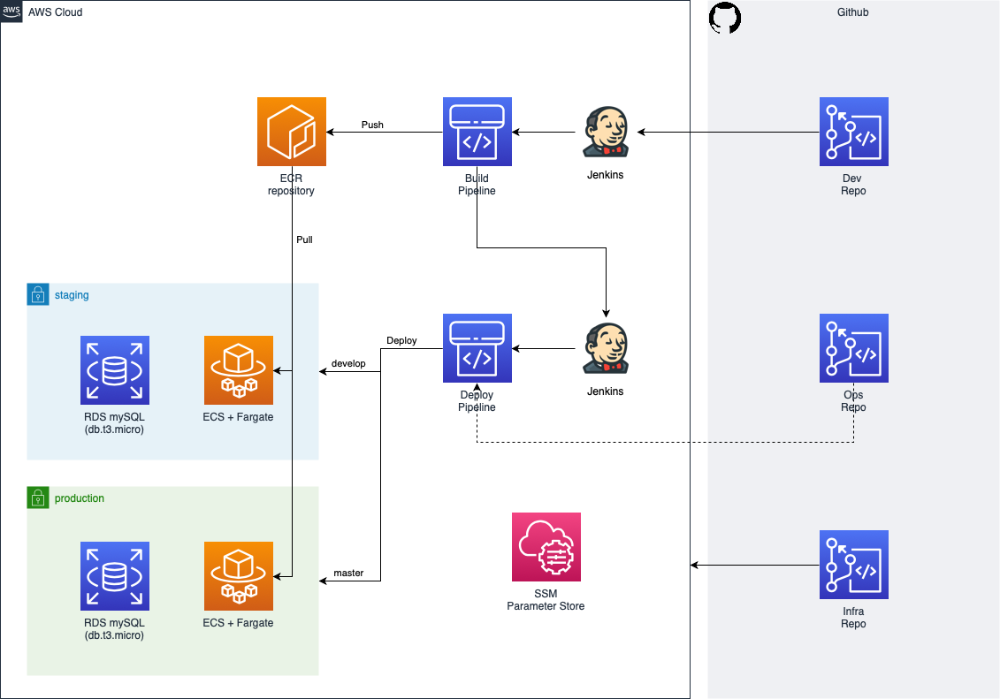

# Wordpress practice project

## Summary

The main objective of this project is to learn how to keep separated development and operations definitions and flows according to the code lifecycle but also how to join all of them to deliver value in an automated and secured way to be as fast as possible.

You will have three repositories with the code of:

* Development team. A base wordpress docker image.
* Operations team. Definition of the deployment of the wordpress image.
* Infrastructure. Definition of the infrastructure resources necessary for our wordpress service.

## Definition

A high level definition of the service we want to have at the infrastructure level could be:

Read carefully the requirements in each repository. These requirements are **hard constraints** for the tasks you will do later:

* https://github.com/neovasili/wp-dev-repo
* https://github.com/neovasili/wp-ops-repo
* https://github.com/neovasili/wp-infra-repo

Create as many issues in each repository as needed and move them across this board when you are working on them. A high level list of tasks for this project could be:

1. Read the project definition (exactly what you're doing right now) and create the issues you consider in each corresponding repository. Add them to the main board: https://github.com/users/neovasili/projects/4
1. [DEV] Prepare DEV repo.
1. [DEV] Create the WP base dockerfile. Check that it works.
1. [DEV] Create the WP base docker-compose file. Check that it works.
1. [INFRA] Prepare INFRA repo.
1. [INFRA] Create the common resources for the ECR repository and the SSM parameters.
1. [INFRA] Deploy them.
1. [DEV] Create the repository webhook to jenkins.
1. [DEV] Create the Jenkinsfile to push to ECR.
1. [DEV] Check that images are pushed to ECR for both develop and master branches and you can distinguish them.
1. [OPS] Prepare OPS repo.
1. [OPS] Create the Jenkinsfile to deploy to ECS (commented by the moment, only echo "hello world").
1. [DEV] Update the Jenkinsfile to trigger the deploy pipeline.
1. [INFRA] Add the staging environment resources.
1. [INFRA] Deploy them.
1. [INFRA] Connect to the RDS database and create the empty WP database.
1. [OPS] Update the Jenkinsfile to deploy to ECS.
1. [OPS] Check that the desired staging service is online.
1. Repeat the last six steps for the production environment.
1. Send the [finish image](https://www.memesmonkey.com/images/memesmonkey/9f/9f38c47ac2c7380d6a88de1dd33fa22c.jpeg).

## Other considerations

**Security is the 0 task**; this means that is much more important to have a well secured environment than complete all the tasks. Anyway, don't worry to put all the resources into a private subnet, use a public subnet restricting access to the resources only with the security groups management.

As you have to avoid to include the staging and production credentials or secrets in the repositories you have to provide them in _deployment time_, so you can consider the use of `AWS Systems Manager Parameter Store` (secured string) to store the content of this file, retrieve it before the deployment, and then apply the change. This can be considered both for **terraform** actions or to provide the **wordpress service** the credentials to connect to the database, for example. Use environment variables anytime if possible.

In order to facilitate the deployment to ECS, you may want to install the [ECS CLI](https://docs.aws.amazon.com/es_es/AmazonECS/latest/developerguide/cmd-ecs-cli.html) into jenkins.
